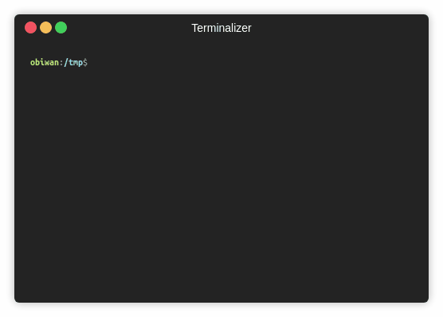

# sad-generator-init

A utility for the command line to set up the [SAD Generator](https://github.com/kgb-workshop/sad-generator) for your academic event.

## Usage

- Install the utility: `npm i & npm link`.
- Run the utility: `sad-generator-init`.

## Tests

- Install dependencies: `npm i`.
- Execute the tests: `npm test`.

## License

[MIT License](LICENSE)
